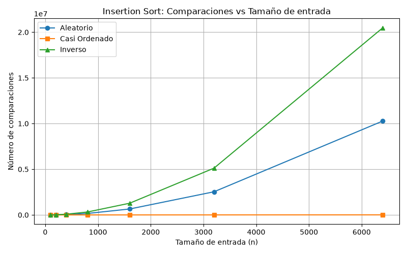
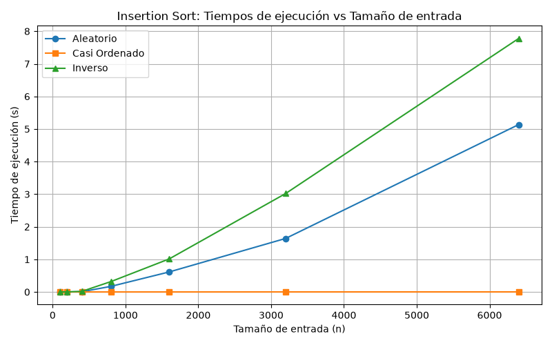

# Laboratorio 1 - Fundamentos, complejidad y recurencias

**Mariana Garcia**

## Parte 1 - Analizar el algoritmo antes de comprar el hardware

### ¿Por qué analizar el algoritmo si lleva 8 años funcionando? 

El hecho de que el programa entregue la respuesta correcta no quiere decir que sea viable para trabajar en producción; existe una clara diferencia entre que un sistema sea correcto y que sea eficiente:

* **Correcto:** Significa que el programa hace lo que se le pide sin errores. En este caso, el algoritmo de Tamiza cumple esto porque ordena el resultado de los pacientes de mayor a menor riesgo.
* **Eficiencia:** Mide el tiempo que demora el sistema para entregar el resultado dentro de un límite adecuado.

Tamiza tiene un algoritmo que entrega la respuesta correcta pero dejó de ser eficiente para las necesidades actuales. El sistema falla porque no cumple con la ventana estricta de 4 horas nocturnas; al no terminar el proceso, la lista queda incompleta y no se puede llamar a los pacientes en orden de prioridad, perdiendo su propósito.

### El problema con Insertion Sort y un nuevo servidor

Antes de gastar presupuesto, es necesario analizar el contexto completo. Tamiza usa *Insertion Sort*, un algoritmo que funciona bien con pocos datos, pero su tiempo de ejecución crece de forma cuadrática **O(n²)** a medida que aumentan los datos.

Al inicio la plataforma procesaba **20.000** registros y el volumen era pequeño, por lo que el servidor operaba sin problemas. Al aumentar el volumen a **1.200.000** registros, el número de datos aumentó **60 veces**; sin embargo, al ser un algoritmo cuadrático, el número de operaciones aumentó $60^2 = 3.600$ **veces más**.

La propuesta de comprar un servidor del doble de velocidad solo reduciría el tiempo a la mitad, lo cual no soluciona el problema frente a un incremento de **3.600 veces** en las operaciones, superando de nuevo las 4 horas límite.

### Ejemplo

En un sistema académico de consulta de notas con **15.000** estudiantes ingresando al mismo tiempo:

Si el sistema busca las notas una a una con ciclos anidados **O(n²)**, el servidor se satura y puede demorarse **3 horas** en procesar las solicitudes. Aunque el resultado final sea 100 % correcto, prácticamente no sirve porque incumple con el tiempo máximo de respuesta del servidor (**5 segundos**) y causa la caída de la página.

## Parte 2 - Responsabilidad ambiental y etica de la implementacion

### Dimension ambiental: Consumo energetico acumulado

Decidir que algoritmo se ejecuta en produccion tambien es una decision ambiental. Un algoritmo con poca eficiencia como *Insertion Sort* mantiene el procesador del servidor trabajando al $100%$ durante las 4 horas en la noche mientras se realiza el proceso. Por otro lado, un algoritmo optimizado y eficiente, resolveria esa misma cantidad de datos en cuestion de segundos.

Mantener la CPU al maximo durante horas es un gasto directo de energia electrica y tambien es un esfuerzo adicional de los sistemas de aire para refrigerar y enfriar el servidor. Cuando este gasto de energia se repite durante los 365 dias del año, durante varios años, la huella de carbono que deja es bastante alta e innecesaria que se habria podido evitar con un algoritmo mas eficiente. 

### Dimension etica: Impacto real en las personas y responsabilidad del costo

Cuando el proceso de analisis y ordenamiento no termina antes de las 6 a.m. entonces la lista de llamadas queda incompleta o desordenada, las consecuencias afectan a personas reales:

* **Retraso en la atención de pacientes en estado crítico:** Si el sistema se corta a las 6 a. m., los pacientes con índices de riesgo cardiovascular muy altos que quedaron al final de la lista no son contactados ese día.
  * **¿Quién asume el costo?** El *paciente*, ya que su salud puede empeorar gravemente o sufrir un evento cardiaco que se pudo prevenir con una cita a tiempo.
* **Uso ineficiente de los recursos de salud:** El centro de llamadas pasa el día contactando a personas con riesgo bajo simplemente porque fueron los registros que el algoritmo alcanzó a procesar antes del corte.
  * **¿Quién asume el costo?** La **Secretaría de Salud**, que malgasta presupuesto y tiempo de los operadores en llamadas que no eran urgentes, dejando desprotegida a la población que más lo necesitaba.

  ### La resopnsabilidad tecnica sobre el orden de la lista

  En este caso, el ordenamiento de la lista no es un proceso meramente tecnico o que se haga porque si, funciona mas bien como un tipo de triaje medico que decide cual es la persona que debe ser atendida primero. 

  Por lo que se exige garantizar que el **algoritmo sea completamente correcto**. Si el sistema llega a fallar o sirve a medias, se altera el orden de prioridad, haciendo que el acceso a la atencion medica dependa mas del funcionamiento o fallos del software que de la urgencia de salud del paciente.

## Parte 3 - Peor caso, mejor caso y caso promedio en Insertion Sort

### 3.1 
### Definicion teorica de los casos

1. **Peor caso:** Es el escenario donde el algoritmo más sufre y hace la mayor cantidad de trabajo.
   * **¿Sobre qué se mide?:** Buscamos el **costo máximo** dentro de todo el grupo de entradas posibles que miden exactamente *n*. Nos da el "techo" o límite superior de tiempo que el algoritmo jamás va a superar para ese tamaño.
2. **Mejor caso :** Es el escenario ideal donde los datos vienen tan acomodados que el algoritmo termina lo más rápido posible.
   * **¿Sobre qué se mide?:** Buscamos el **costo mínimo** entre todas las entradas posibles que miden exactamente *n*. Nos muestra lo más rápido que puede llegar a correr si el orden inicial lo favorece al máximo.
3. **Caso promedio:** Es lo que esperamos que pase en un día normal de operación con datos reales o desordenados al azar.
   * **¿Sobre qué se mide?:** Se calcula sacando un **promedio ponderado** sobre todas las entradas de tamaño *n*, teniendo en cuenta qué tan probable es que nos llegue cada tipo de datos en la práctica. 

### Criterio de decision en produccion

Para definir si este algoritmo sirve para **Tamiza** dentro de las 4 horas necesarias, pues debemos basarnos si o si en el **peor caso** porque si nos confiamos y asumimos que siempre sera el caso promedio, el dia que los datos lleguen atipicamente invertidos, haria que el tiempo de produccion sobrepase las 4 horas, provocando que el proceso vuelva a colapsar. 

### Prediccion teorica para los escenarios 

Dado que muestroalgoritmo ordena de **mayor a menor** 
* **Prediccion del peor caso:** Escenario C (*Inverso*) porque en el caso completamente inverso, debe comparar elemento por elemento, reacomodando a cada uno en su ubicacion contraria, entonces para hacer la comparacion e insercion de cada elemento, es el caso que mas tiempo toma.
* **Prediccion del mejor caso:** Escenario B (*Casi ordenado*) porque aunque deba seguir lacomparacion de todos los elementos, pues la mayoria ya estan en su ubicacion excata, entonces demora menos tiempo, por ejemplo en este caso, solo el 2% de los elementos estan en un orden aleatorio, lo que hace que demore menos tiempo en ejecucion.
* **Prediccion caso promedio:** Escenario A (*Aleatorio*) porque demora la mitad de tiempo que el peor caso, porque como esta aleatoria pero no inversa, entonces encuentra su ubicacion correcta en la mitad del camino, por lo que demora la mitad del tiempo.

### Graficas y comparaciones

A continuación se presentan las gráficas obtenidas tras ejecutar los experimentos evaluando los tres escenarios sobre los tamaños $n \in \{100, 200, 400, 800, 1600, 3200, 6400\}$:

#### Comparaciones vs. Tamaño de Entrada ($n$)

#### Tiempo de Ejecución vs. Tamaño de Entrada ($n$)

* **Peor Caso $\rightarrow$ Escenario C (Inverso - Línea Verde):** Curva parabólica ascendente con el crecimiento más pronunciado. En $n = 6400$, llegó a aproximadamente $2.0 \times 10^7$ comparaciones y cerca de 8 segundos de ejecución.
* **Mejor Caso $\rightarrow$ Escenario B (Casi Ordenado - Línea Naranja):** Curva completamente plana sobre el eje horizontal, registrando un número de comparaciones que escala de manera lineal y tiempos de ejecución prácticamente instantáneos (cercanos a 0 segundos).
* **Caso Promedio $\rightarrow$ Escenario A (Aleatorio - Línea Azul):** Curva cuadrática intermedia que crece con una pendiente proporcional a la mitad del peor caso (alrededor de $1.0 \times 10^7$ comparaciones en $n = 6400$). 

**Análisis de la coincidencia:**
Los resultados experimentales coinciden al 100% con la predicción inicial. Como el algoritmo ordena de **mayor a menor**:
1. Entregarle los datos ordenados en sentido contrario (ascendente, 1 a $n$) obligó a desplazar cada nuevo número a lo largo de todo el subarreglo ordenado antes de insertarlo, desencadenando el peor comportamiento posible $O(n^2)$.
2. Entregarle un vector preordenado casi al 98% de mayor a menor permitió que el bucle interno rompiera la condición en la primera evaluación la gran mayoría de las veces, confirmando la complejidad $O(n)$.
3. El escenario aleatorio requirió en promedio desplazar los elementos hasta la mitad de la secuencia ordenada, generando la mitad exacta del costo del peor caso.