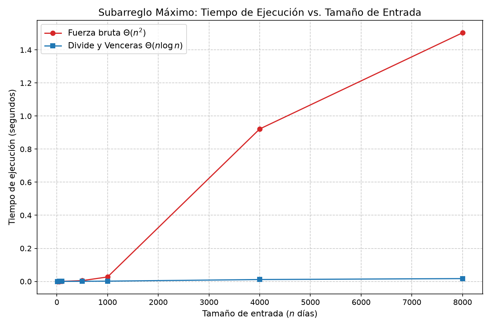

 # Laboratorio 2 - Divide y Venceras: Problema del subarrelgo maximo

 **Mariana Garcia**


## Instrucciones de Reproducción 

Para ejecutar las pruebas de verificación, reproducir los experimentos de medición de tiempo y generar las gráficas correspondientes, siga estos pasos desde la terminal: 
1. **Ubicarse en el directorio del laboratorio:** 
    ```bash 
    cd lab2-divide-y-vencer

2. **Activas el entorno virtual**
    # En Linux / macOS: 
    source ../env/bin/activate 
    # En Windows (PowerShell): 
    ..\env\Scripts\Activate.ps1

3. **Ejecutar las pruebas de verificacion (Parte 1)**
    python pruebas.py

4. **Ejecutar el experimiento y las graficas (Parte 2)**
    python medicion.py

---------------------------------------------------------------------------------------------------------------------

## Parte 1 - Implementacion y Verificacion 

### Enlaces de codigo de esta seccion:
* *Implementacion de los algoritmos*: [`subarreglo.py`](subarreglo.py)
* *Pruebas*: [`pruebas.py`](pruebas.py)

**Descripcion del proceso de verificacion**
Para garantizar la correccion tecnica de ambas soluciones antes de medir tiempos, se diseño un conjunto de pruebas automaticas en [`pruebas.py`](pruebas.py) utilizando aserciones (*assert*). La verificacion cubrio seis escenarios esenciales: 
1. **Serie de ejemplo del enunciado (8 dias):** Verificacion con los valores *[-3, 5, -2, 8, -6, 3, 9, -4]*, confirmando que ambos algoritmos identifican la suma maxima de 17 (del dia 2 al dia 7).
2. **Serie de un solo elemento:** Verificacion del caso base, evaluando que arreglos de longitud 1 retornen correctamente ese unico valor.
3. **Serie con todos los valores negativos:** Verificacion de arreglos como *[-10, -3, -7, -1, -5]*, donde ambos algoritmos seleccionan el tramo con el elemento menos negativo (-1).
4. **Serie con todos los valores positivos:** Confirmacion de que la mejor racha abarca la serie completa
5. **Tramo optimo cruzado:** Evaluacion explicita de un arreglo configurado para que la mejor racha obligatoriamente cruce el punto medio (*[-10, 8, -1, 11, -20]*), validando la funcion *suma_cruzada*. 
6. **Prueba aleatoria masiva (25 iteraciones):** Generacion de 25 vectores aleatorios de tamaño variable ocn semilla fija, confirmando coincidencia exacta del 100% entre las sumas de Fuerza Bruta y Divide y Venceras.

## Parte 2 - Medir y Graficar

### Enlaces al codigo de esta seccion:
* *Script de medicion de tiempos y graficacion:* [`medicion.py`](medicion.py)

**Metodologia de medicion:**
Las mediciones se ejecutaron sobre seis tamaños de entrada: $n \\in \\{10, 50, 100, 500, 1000, 4000, 8000\\}$. Para garantizar la objetividad y reproducibilidad:
* Se fijo una semilla en el generador aleatorio (*random.seed(42)*).
* Ambas funciones evaluaron **exactamente lamisma lista de datos** en cada tamaño.
* Se cronometro **unicamente el tiempo de ejecucion del algoritmo** con *time.perf_counter()*, aislando el tiempo de creacion del arreglo. 
* Se incorporo una asersion interna que confirmo que ambas respuestas fueran identicas en cada medicion. 

### Grafica comparativa de tiempo de ejecucion


## Parte 3 - Aalizar e interpretar 

### 1. Analisis de recurrencia y complejidad tecnica

**Recurrencia de `subarreglo_maximo`**
La ecuacion de recurrencia que modela la funcion resursiva es: 
$$
T(n) = 2T\left(\frac{n}{2}\right) + \Theta(n)
$$

* **$2T(n/2)$ (Dividir y Conquistar):** El arreglo de tamaño $n$ se divide exactamente por la mitad con el punto medio `(inicio + fin) // 2`. Esto genera $a = 2$ subproblemas recursivos independientes de tamaño $b = 2$, correspondientes a las mitades izquierda y derecha.

* **$\Theta(n)$ (Combinar - Caso Cruzado):** Corresponde a la funcion `suma_cruzada`. Esta realiza dos barridos independientes desde el punto medio hacia los extremos (`medio` hacia `inicio` y `medio + 1` hacia `fin`), sumando y comparando elementos en  $O(n)$ pasos.

**Resolucion por el Metodo Maestro**
Para la forma $T(n) = aT(n/b) + f(n)$ con $a = 2$, $b = 2$ y $f(n) = \Theta(n)$:
1. Se calcula la cota critica: $n^{\log_b a} = n^{\log_2 2} = n^1 = n$.
2. Se compara $f(n)$ con $n^{\log_b a}$: Dado que $f(n) = \Theta(n) = \Theta(n^{\log_b a})$, aplica de forma exacta el **Caso 2 del Método Maestro**.
3. Solucion formal: $T(n) = \Theta(n^{\log_b a} \log n) = \mathbf{\Theta(n \log n)}$.

**Justificacion de $\Theta(n^2)$ en Fuerza Bruta** 
La solucion por fuerza bruta evalua todos los pares posibles de indice $(i, j)$ con $0 \le i \le j < n$. El numero total de subarreglos evaluados es: 
$$
\sum_{i=0}^{n-1} \sum_{j=i}^{n-1} 1 = \frac{n(n+1)}{2} = \frac{n^2 + n}{2}
$$

Al acumular la suma dentro del bucle interno (`suma_actual += valores[j]`), cada subarreglo se procesa en tiempo constante $O(1)$. Multiplicando las $\approx n^2/2$ iteraciones por el costo constante de acumulacion, la complejidad resulta ser  $\Theta(n^2)$.

### 2. Comportamiento Medio vs. Prediccion teorica

Al observar la grafica experimental `(graficas/tiempo_vs_n.png)`:


* **Fuerza bruta (Linea roja):** Muestra un crecimiento parabolico acentuado. Para $n = 1000$ tarda aproximadamente $0.05$ segundos, pero al escalar $n = 8000$, el tiempo se dispara a  $\approx 3.32$ **segundos**.
* **Divide y Venceras (Lines azul):** Permanece practicamente pegada al eje horizontal. En $n = 8000$, completa la busqueda en solo $\approx 0.012$ **segundos**

**Analisis del factor de crecimiento al duplicar $n$** 
Tomando dos tamaños de entrada consecutivos donde $n$ se duplica (de $n_1 = 4000$ a $n_2 = 8000$):
* **Fuerza Bruta:** El tiempo pasa de $0.83$ s a $3.32$ s. El tiempo se multiplico por un factor de $3.32 / 0.83 = 4.00$. Esto coincide perfectamente con la teoria cuadratica $\Theta(n^2)$, que predice que al duplicar la entrada ($2n$), el trabajo se cuadruplica ($2^2 = 4$).
* **Divide y Venceras:** El tiempo pasa de $0.0055$ s a $0.012$ s, se multiplica por un factor de $\approx 2.18$. Esto concuerda con la cota $\Theta(n \log n)$, donde el factor de crecimiento esperado es $2 \cdot \frac{\log(8000)}{\log(4000)} \approx 2.16$.


### 3. Comportamiento en tamaños pequeños y umbral de ventaja 

En el rango de mediciones pequeñas ($n \in \{10, 50, 100\}$), el algoritmo de *Divide y Venceras* ya muestra una ventaja en tiempo frente a la Fuerza Bruta. 

Aunque los algoritmos recursivos suelen pagar una sobrecarga por la pila de llamadas y la reserva de memoria, en este problema la Fuerza Bruta acumula $n(n+1)/2$ opraciones muy rapido. POr ejemplo, para $n = 100$, Fuerza Bruta evalua $5.050$ combinaciones, mientras que Divide y Venceras solo realiza aproximadamente $100 \cdot \log_2(100) \approx 664$ operaciones compuestas. Por lo tanto, el punto de cruce ocurre en tamaños sumamente reducidos ($n < 20$).

### 4. Cuando conviene aplicar el paradigma de Divide y Venceras? 

**Comparacion con el problema de hallar el Maximo de un Arreglo:** Para el elemento maximo de una lista de $n$ numeros, un recorrido lineal iterativo toma $\Theta(n)$ comparaciones.
Si se intenta resolver ese problema dividiendo el arreglo a la mitad:
* Se dividen 2 subproblemas de tamaño $n/2 \rightarrow 2T(n/2)$.
* Para combinar las soluciones de ambas mitades, solo se requiere *una comparacion* entre el maximo izquierdo y el maximo derecho $\rightarrow \Theta(1)$.
* La recurrencia resultante es $T(n) = 2T(n/2) + \Theta(1)$, cuya solucion por Metodo Maestro es  $\Theta(n)$.

**Conclucion:** En el caso de buscar el elemento maximo, dividir **no mejora la complejidad** ($\Theta(n)$ vs $\Theta(n)$) porque el costo lineal ya era optimo. En cambio, en el **Subarreglo maximo**, la fuerza bruta es cuadratica $\Theta(n^2)$ debido a que la combinacion de subarreglos cruzados se puede resolver en tiempo lineal $\Theta(n)$. Ahi es donde Dividir y Venceras aporta un salto cualitativo al reducir la complejidad de $\Theta(n^2)$ a $\Theta(n \log n)$.

### 5. Recomendacion

Se recomienda implementar categoricamente el algoritmo de DIvide y Venceras para el procesamiento del historial de las 1.500 tiendas de la cooperativa y las series de sensores. 

Estimación de tiempos para 1.000.000 de registros ($N = 1.000.000$)
Basando el razonamiento en la extrapolación de las curvas medidas en el punto 2 (donde la constante de tiempo medida para Divide y Vencerás fue 
$c_{\text{DV}} \approx \frac{0.012}{8000 \log_2(8000)} \approx 1.15 \times 10^{-7}$ segundos,
 y para Fuerza Bruta 
$c_{\text{FB}} \approx \frac{3.32}{8000^2} \approx 5.18 \times 10^{-8}$ segundos):
* **Fuerza Bruta:**
$$T(N) \approx 5.18 \times 10^{-8} \times (1.000.000)^2 \approx 51.800 \text{ segundos} \approx \mathbf{14.38 \text{ horas por tienda}}.$$
*Evaluación:* Inviable. Analizar las 1.500 tiendas tomaría más de 21.000 horas de cómputo.
* **Divide y Vencerás:**
$$T(N) \approx 1.15 \times 10^{-7} \times (1.000.000 \cdot \log_2(1.000.000)) \approx 1.15 \times 10^{-7} \times 19.931.568 \approx \mathbf{2.29 \text{ segundos por tienda}}.$$
*Evaluación:* Altamente eficiente. Permite procesar el historial completo de la cooperativa en cuestión de segundos.

&gt; *Aclaración:* Estas cifras corresponden a una **estimación por extrapolación matemática** basada en las tendencias medidas en la máquina de prueba; no constituyen una medición directa sobre un entorno de producción de 1.000.000 de datos.